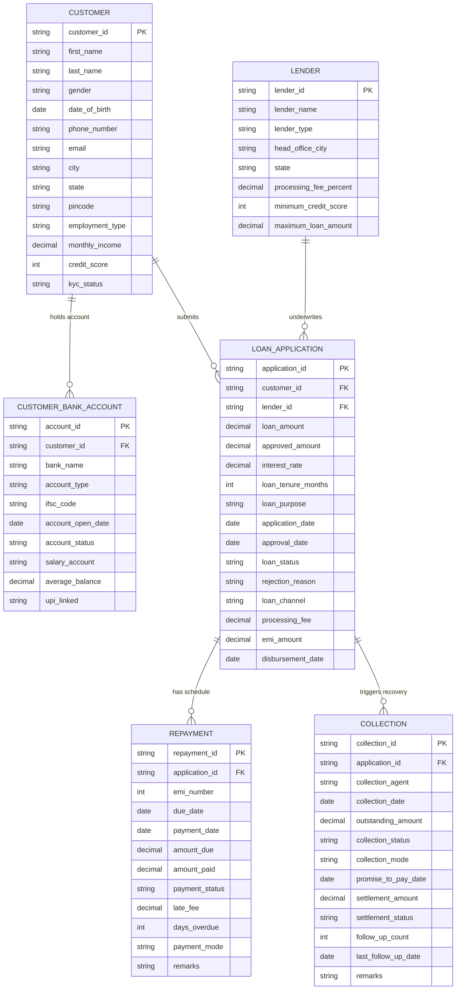

# Digital Lending Funnel & Loan Portfolio Analysis Data Generator

A production-grade Python data engineering repository that generates realistic, high-fidelity relational synthetic datasets for a **Digital Lending System in India**. 

This repository models the complete end-to-end digital lending lifecycle—from loan application funnel acquisition to credit underwriting, loan disbursement, EMI repayment schedules, delinquency tracking, and debt recovery collections.

It is designed specifically for **MySQL SQL Case Studies**, **Power BI / Tableau Portfolio Dashboards**, and **Data Analyst / Financial Analytics Projects**.

---

## 📌 Project Overview

- **Total Tables**: 6 Relational Tables
- **Total Generated Rows**: **16,020+ Records**
  - `customer`: 1,500 rows
  - `lender`: 20 rows
  - `customer_bank_account`: 1,500 rows
  - `loan_application`: 3,000 rows (68% Approved, 18% Rejected, 14% Pending)
  - `repayment`: 8,000 rows
  - `collection`: 2,000 rows
- **Target Database**: MySQL 8.0+
- **Domain**: Indian FinTech, Digital Lending, Credit Underwriting & Risk Collections

---

## 🏗 Data Architecture & Relationships



---

## ⚙️ Key Business & Financial Logic Implemented

1. **Exact Financial Compound EMI Formula**:
   $$\text{EMI} = P \times r \times \frac{(1+r)^n}{(1+r)^n - 1}$$
   where $P = \text{Approved Amount}$, $r = \frac{\text{Annual Interest Rate}}{12 \times 100}$, $n = \text{Tenure Months}$.

2. **Risk-Based Interest Pricing**:
   - **Credit Score ≥ 780**: 10.5% – 13.5% (Prime borrower)
   - **Credit Score 720 – 779**: 13.6% – 16.5% (Near-prime)
   - **Credit Score 670 – 719**: 16.6% – 21.0% (Sub-prime)
   - **Credit Score 600 – 669**: 21.1% – 26.0% (High risk)
   - **Credit Score < 600**: 26.1% – 32.0% (Deep sub-prime)

3. **Loan Status Lifecycle Rules**:
   - **68% Approved (~2,040 rows)**: Approved amount $\le$ requested loan amount, EMI calculated, valid approval and disbursement dates set.
   - **18% Rejected (~540 rows)**: `approved_amount`, `approval_date`, `disbursement_date`, `interest_rate`, `processing_fee`, and `emi_amount` are strictly `NULL`; `rejection_reason` populated.
   - **14% Pending (~420 rows)**: All decision fields strictly `NULL`.

4. **Strict Referential Dependencies**:
   - Repayment records exist **exclusively** for approved loans.
   - Collection records exist **exclusively** for loans experiencing missed or late payments.

5. **Indian Localization Realism**:
   - Real Indian Banks (HDFC, SBI, ICICI, Axis, Kotak, etc.) & standard 11-digit IFSC codes (`SBIN0001234`).
   - Real Indian NBFCs & Banks (Bajaj Finance, Tata Capital, Navi, KrazyBee, etc.).
   - Tier 1 & Tier 2 Indian cities mapped accurately to state and valid 6-digit PIN codes.

---

## 📁 Repository Directory Structure

```
Digital_Lending_Data_Generator/
│
├── data/                            # Generated CSV output directory
│   ├── customer.csv
│   ├── lender.csv
│   ├── customer_bank_account.csv
│   ├── loan_application.csv
│   ├── repayment.csv
│   └── collection.csv
│
├── sql/                             # MySQL DDL & Import Scripts
│   ├── 01_Create_Database.sql       # Database creation & character set config
│   ├── 02_Create_Tables.sql         # DDL schemas with Primary & Foreign keys
│   └── 03_Import_Data.sql           # Production LOAD DATA INFILE script
│
├── generator/                       # Python Modular Generator Package
│   ├── __init__.py
│   ├── config.py                    # Constants, mappings & row count rules
│   ├── helper.py                    # Financial math & random data generators
│   ├── generate_lenders.py          # 20 Lender master records generator
│   ├── generate_customers.py        # 1,500 Customer records generator
│   ├── generate_bank_accounts.py    # 1,500 Bank Account records generator
│   ├── generate_loan_applications.py# 3,000 Loan Application records generator
│   ├── generate_repayments.py       # 8,000 Repayment records generator
│   ├── generate_collections.py      # 2,000 Collection records generator
│   └── validator.py                 # Automated quality control suite
│
├── main.py                          # Master orchestration execution script
├── requirements.txt                 # Python project dependencies
├── README.md                        # Documentation & SQL Case Studies
└── .gitignore                       # Git ignore rules
```

---

## 🚀 Quick Start Guide

### 1. Prerequisites & Environment Setup

Clone the repository and install dependencies:

```bash
git clone https://github.com/your-username/Digital_Lending_Data_Generator.git
cd Digital_Lending_Data_Generator

# Create and activate virtual environment (optional)
python -m venv venv
# On Windows:
venv\Scripts\activate
# On macOS/Linux:
source venv/bin/activate

# Install required Python packages
pip install -r requirements.txt
```

### 2. Generate Synthetic Datasets

Run the main generator script:

```bash
python main.py
```

**Output Terminal Summary**:
```
==========================================================
    DIGITAL LENDING FUNNEL & PORTFOLIO DATA GENERATOR     
==========================================================

[INIT] Output directory initialized at: .../data

Step 1/8: Generating Lender Master Data...
[SUCCESS] Generated 20 Lender records.

Step 2/8: Generating Customer Demographic & Financial Data...
[SUCCESS] Generated 1500 Customer records.

Step 3/8: Generating Customer Bank Account Data...
[SUCCESS] Generated 1500 Customer Bank Account records.

Step 4/8: Generating Loan Application Lifecycle Data...
[SUCCESS] Generated 3000 Loan Application records (2040 Approved, 540 Rejected, 420 Pending).

Step 5/8: Generating Repayment & EMI Schedule Data...
[SUCCESS] Generated 8000 Repayment records.

Step 6/8: Generating Delinquent Collection Data...
[SUCCESS] Generated 2000 Collection records.

Step 7/8: Executing Data Integrity & Business Logic Validations...

==================================================
         EXECUTING DATASET VALIDATION SUITE       
==================================================
[PASS] Duplicate PK Check - Customer: All 1500 records have unique customer_id.
[PASS] Duplicate PK Check - Lender: All 20 records have unique lender_id.
[PASS] Duplicate PK Check - Bank Account: All 1500 records have unique account_id.
[PASS] Duplicate PK Check - Loan Application: All 3000 records have unique application_id.
[PASS] Duplicate PK Check - Repayment: All 8000 records have unique repayment_id.
[PASS] Duplicate PK Check - Collection: All 2000 records have unique collection_id.
[PASS] FK Integrity - Bank Account -> Customer: 100% foreign key match.
[PASS] FK Integrity - Loan Application -> Customer: 100% foreign key match.
[PASS] FK Integrity - Loan Application -> Lender: 100% foreign key match.
[PASS] FK Integrity - Repayment -> Approved Loan App: All repayments belong strictly to approved loans.
[PASS] FK Integrity - Collection -> Loan App: 100% foreign key match.
[PASS] Loan Logic - Approved Amount Rule: All approved amounts are <= requested amounts.
[PASS] Loan Logic - Rejected Loans NULL Rule: All rejected loans have NULL approved_amount/dates.
[PASS] Loan Logic - Pending Loans NULL Rule: All pending loans have NULL approval/disbursement details.
[PASS] Date Chronology - Application <= Approval: All approval dates follow application dates.
[PASS] Date Chronology - Approval <= Disbursement: All disbursement dates follow approval dates.
--------------------------------------------------
VALIDATION SUMMARY: 16/16 Checks Passed.
==================================================

Step 8/8: Exporting Datasets to CSV Files...
 -> Exported 'customer.csv' (1,500 rows)
 -> Exported 'lender.csv' (20 rows)
 -> Exported 'customer_bank_account.csv' (1,500 rows)
 -> Exported 'loan_application.csv' (3,000 rows)
 -> Exported 'repayment.csv' (8,000 rows)
 -> Exported 'collection.csv' (2,000 rows)

==========================================================
 PROCESS COMPLETED SUCCESSFULLY IN 1.85 SECONDS!
 TOTAL ROWS GENERATED ACROSS 6 TABLES: 16,020
==========================================================
```

---

## 🗄️ MySQL Database Import Guide

To load the generated CSV files into your local or cloud MySQL instance:

1. Open MySQL Workbench, DBeaver, or terminal CLI:
   ```bash
   mysql -u root -p
   ```

2. Execute SQL scripts in numerical order:
   ```sql
   SOURCE sql/01_Create_Database.sql;
   SOURCE sql/02_Create_Tables.sql;
   ```

3. Update the file paths in `sql/03_Import_Data.sql` to your absolute system path and run:
   ```sql
   SOURCE sql/03_Import_Data.sql;
   ```

---

## 📊 Sample SQL Portfolio Queries & Analytical Case Studies

### Case Study 1: Funnel Approval Rate & Rejection Breakdown by Acquisition Channel
```sql
SELECT 
    loan_channel,
    COUNT(*) AS total_applications,
    SUM(CASE WHEN loan_status = 'Approved' THEN 1 ELSE 0 END) AS approved_count,
    SUM(CASE WHEN loan_status = 'Rejected' THEN 1 ELSE 0 END) AS rejected_count,
    SUM(CASE WHEN loan_status = 'Pending' THEN 1 ELSE 0 END) AS pending_count,
    ROUND(SUM(CASE WHEN loan_status = 'Approved' THEN 1 ELSE 0 END) * 100.0 / COUNT(*), 2) AS approval_rate_pct
FROM loan_application
GROUP BY loan_channel
ORDER BY approval_rate_pct DESC;
```

### Case Study 2: Lender Portfolio Yield & Processing Fee Revenue
```sql
SELECT 
    l.lender_name,
    l.lender_type,
    COUNT(a.application_id) AS total_approved_loans,
    ROUND(SUM(a.approved_amount), 2) AS total_disbursed_principal,
    ROUND(AVG(a.interest_rate), 2) AS avg_interest_rate_pct,
    ROUND(SUM(a.processing_fee), 2) AS total_processing_fee_revenue
FROM lender l
JOIN loan_application a ON l.lender_id = a.lender_id
WHERE a.loan_status = 'Approved'
GROUP BY l.lender_id, l.lender_name, l.lender_type
ORDER BY total_disbursed_principal DESC;
```

### Case Study 3: Risk Band Default & Overdue Rate Analysis
```sql
SELECT 
    CASE 
        WHEN c.credit_score >= 780 THEN 'Prime (780-900)'
        WHEN c.credit_score >= 720 THEN 'Near Prime (720-779)'
        WHEN c.credit_score >= 670 THEN 'Subprime (670-719)'
        WHEN c.credit_score >= 600 THEN 'High Risk (600-669)'
        ELSE 'Deep Subprime (<600)'
    END AS credit_risk_tier,
    COUNT(DISTINCT a.application_id) AS approved_loans,
    SUM(r.amount_due) AS total_due_amount,
    SUM(r.amount_paid) AS total_paid_amount,
    SUM(r.late_fee) AS total_late_fees_levied,
    ROUND(SUM(CASE WHEN r.payment_status = 'Missed' THEN 1 ELSE 0 END) * 100.0 / COUNT(r.repayment_id), 2) AS default_rate_pct
FROM customer c
JOIN loan_application a ON c.customer_id = a.customer_id
JOIN repayment r ON a.application_id = r.application_id
WHERE a.loan_status = 'Approved'
GROUP BY credit_risk_tier
ORDER BY default_rate_pct DESC;
```

---

## 📜 License & Usage
This project is open-source under the MIT License. Feel free to use this dataset generator for portfolio projects, SQL tutorials, data analysis case studies, and interview preparation!
